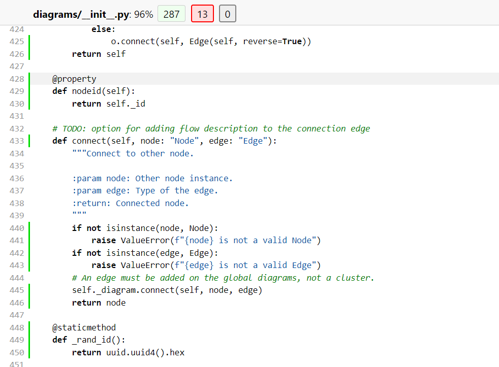

# Report for Assignment 1 resit

## Project chosen

Name: Diagrams

URL: https://github.com/mingrammer/diagrams

Number of lines of code and the tool used to count it: 6805 nloc, counted by lizard

Programming language: python

## Coverage measurement with existing tool

<Inform the name of the existing tool that was executed and how it was executed>
The tool used to measure coverage is Coverage.py, it was used by writing 
coverage report 
in terminal

<Show the coverage results provided by the existing tool with a screenshot>

## Coverage improvement
	
### Individual tests

<The following is supposed to be repeated for each function (2 in total)>

<Function 1>

<Show a patch (diff) or a link to a commit made in your forked repository that shows the new/enhanced tests for function 1>

Unfortunately I used one commit for all the changes, therefore I cannot add different commit links. The test coverage I improved is the one in line 421.

Screenshot of the old coverage results for such function

Screenshot of the new coverage results for such function

<State the coverage improvement with a number and elaborate on why the coverage is improved>

After viewing first coverage result presented in html, I decided to work on improving functions of already existing tests for them to cover all the lines that were not covered properly before.
In this case, I developed new function in line 203 called test_invalid _node 

<Function 2>

<Show a patch (diff) or a link to a commit made in your forked repository that shows the new/enhanced tests for function 2>

Unfortunately I used one commit for all the changes. The test coverage I improved is the one in line 423.

Screenshot of the old coverage results for such function

Screenshot of the new coverage results for such function

<State the coverage improvement with a number and elaborate on why the coverage is improved>

After viewing first coverage result presented in html, I decided to work on improving functions of already existing tests for them to cover all the lines that were not covered properly before.
In this case, I developed new function in line 209 called test_invalid_edge.

### Overall

Screenshot of the old coverage results by running an existing tool (the same as you already showed at the beginning of the report)

Screenshot of the new coverage results by running the existing tool using all test modifications

